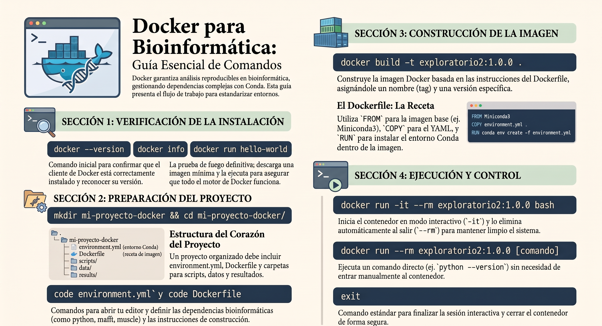

# SUMMARY



---

# 🐳 Tutorial Completo de Docker para Bioinformática: De Cero a Entorno Reproducible

> **Objetivo:** Aprender Docker desde la instalación hasta crear una imagen reproducible basada en un entorno Conda (`exploratorio`).

---

## Tabla de Contenidos

- [SUMMARY](#summary)
- [🐳 Tutorial Completo de Docker para Bioinformática: De Cero a Entorno Reproducible](#-tutorial-completo-de-docker-para-bioinformática-de-cero-a-entorno-reproducible)
  - [Tabla de Contenidos](#tabla-de-contenidos)
  - [1. ¿Por qué Docker en Bioinformática?](#1-por-qué-docker-en-bioinformática)
  - [2. Instalación de Docker](#2-instalación-de-docker)
    - [Linux (Ubuntu/Debian)](#linux-ubuntudebian)
- [3. macOS](#3-macos)
- [4. Windows](#4-windows)
- [5. Comandos Esenciales](#5-comandos-esenciales)
  - [Ciclo de Vida de Contenedores](#ciclo-de-vida-de-contenedores)
- [6. Gestión de Imágenes](#6-gestión-de-imágenes)
- [7. El Dockerfile: Traduciendo tu YAML](#7-el-dockerfile-traduciendo-tu-yaml)
- [8. Crear archivo YAML (yml) y Dockerfile](#8-crear-archivo-yaml-yml-y-dockerfile)
  - [Primero creamos lo sgte:](#primero-creamos-lo-sgte)
  - [yml: ejecutamos el sgte comando,puedes usar el comando nano, code o el de tu editor favorito, en mi caso usare code:](#yml-ejecutamos-el-sgte-comandopuedes-usar-el-comando-nano-code-o-el-de-tu-editor-favorito-en-mi-caso-usare-code)
  - [Dockerfile: ejecutamos el sgte comando,puedes usar el comando nano, code o el de tu editor favorito, en mi caso usare code:](#dockerfile-ejecutamos-el-sgte-comandopuedes-usar-el-comando-nano-code-o-el-de-tu-editor-favorito-en-mi-caso-usare-code)
- [9.Construir la imagen Docker](#9construir-la-imagen-docker)
- [10.  Verificar la imagen creada](#10--verificar-la-imagen-creada)
- [11. Ejecutar el contenedor en modo interactivo](#11-ejecutar-el-contenedor-en-modo-interactivo)
- [12. Salir del contenedor](#12-salir-del-contenedor)
- [12. Ejecutar un comando directo (sin entrar al contenedor)](#12-ejecutar-un-comando-directo-sin-entrar-al-contenedor)
---

## 1. ¿Por qué Docker en Bioinformática?

| Problema con Conda solo | Solución con Docker |
| :--- | :--- |
| "En mi máquina funciona" | El contenedor es idéntico en cualquier SO |
| Conflictos de librerías del sistema (glibc, etc.) | El SO base está incluido en la imagen |
| Difícil compartir entornos complejos | Una imagen = un archivo descargable |
| Dependencias de herramientas no-Conda (make, gcc) | Todo se instala en el mismo layer |
| Reproducir análisis de papers antiguos | Las imágenes pueden versionarse y archivarse |

> 💡 **Regla de oro:** Usa **Conda dentro de Docker**. Conda gestiona las dependencias bioinformáticas; Docker gestiona el sistema operativo y la portabilidad.

---

## 2. Instalación de Docker

### Linux (Ubuntu/Debian)

```bash
curl -fsSL https://download.docker.com/linux/ubuntu/gpg | sudo gpg --dearmor -o /etc/apt/keyrings/docker.gpg

echo   "deb [arch=$(dpkg --print-architecture) signed-by=/etc/apt/keyrings/docker.gpg] https://download.docker.com/linux/ubuntu $(lsb_release -cs) stable" | sudo tee /etc/apt/sources.list.d/docker.list > /dev/null

sudo apt update

sudo apt install docker-ce docker-ce-cli containerd.io docker-buildx-plugin docker-compose-plugin

sudo usermod -aG docker $USER

sudo systemctl status docker

docker run hello-world
```

---

# 3. macOS  
Descargar Docker Desktop for Mac  
Arrastrar a Aplicaciones e iniciar  
Verificar en terminal: docker --version  

---

# 4. Windows  
Instalar WSL2 primero: wsl --install en PowerShell (admin)  
Descargar Docker Desktop for Windows  
Habilitar "Use WSL 2 based engine" en configuración  
Verificar en terminal: docker --version  
Verificación Post-Instalación  

---

```bash
docker --version        # Versión del cliente
docker info             # Estado del daemon
docker run hello-world  # Test de funcionamiento
```

---
# 5. Comandos Esenciales
## Ciclo de Vida de Contenedores


```bash
# CREAR y EJECUTAR
docker run -it nombre_imagen bash          # Interactivo con terminal
docker run -d nombre_imagen                # En segundo plano (detached)
docker run --rm -it nombre_imagen bash     # Auto-eliminar al salir

# LISTAR
docker ps                                  # Contenedores activos
docker ps -a                               # Todos (incluyendo detenidos)

# DETENER / INICIAR / ELIMINAR
docker stop <container_id>                 # Detener gracefully
docker start <container_id>                # Reiniciar detenido
docker rm <container_id>                   # Eliminar contenedor
docker rm $(docker ps -aq)                 # Eliminar TODOS los contenedores

# INSPECCIONAR
docker exec -it <container_id> bash        # Entrar a contenedor activo
docker logs <container_id>                 # Ver stdout/stderr
docker inspect <container_id>              # Metadata completa (JSON)
```

---

# 6. Gestión de Imágenes

```bash
# CONSTRUIR
docker build -t mi_imagen:v1 .             # Desde Dockerfile en directorio actual

# LISTAR / ELIMINAR
docker images                              # Listar imágenes locales
docker rmi mi_imagen:v1                    # Eliminar imagen
docker system prune -a                     # Limpieza total (imágenes + cache)

# PULL / PUSH
docker pull biocontainers/samtools:v1.19   # Descargar de registry
docker tag mi_imagen:v1 usuario/repo:v1    # Etiquetar para push
docker push usuario/repo:v1               # Subir a registry
```

---

# 7. El Dockerfile: Traduciendo tu YAML
Este es el corazón de un proyecto. Vamos a convertir tu environment.yml en una imagen Docker optimizada.

**Estructura del Proyecto**

proyecto-exploratorio/  
├── environment.yml       ← Tu YAML original  
├── Dockerfile            ← Receta de construcción  
├── data/                 ← Datos de entrada (NO se copia en la imagen)  
├── results/              ← Salida (volumen montado)  
└── scripts/              ← Tus scripts de análisis  

---

# 8. Crear archivo YAML (yml) y Dockerfile
## Primero creamos lo sgte:

```bash
mkdir mi-proyecto-docker
cd mi-proyecto-docker/
```
## yml: ejecutamos el sgte comando,puedes usar el comando nano, code o el de tu editor favorito, en mi caso usare code:

```bash
code environment.yml
```

 - Esto me creara mi archivo y se abrira un edito de manera automatica
 - Dentro de este pegamos copiamos y pegamos esto:


```bash
name: exploratorio2

channels:
  - conda-forge
  - bioconda
  - defaults

dependencies:
  - python=3.9.18
  - ncbi-datasets-cli=16.10.0
  - unzip=6.0
  - mafft=7.520
  - muscle=5.1
```

---

## Dockerfile: ejecutamos el sgte comando,puedes usar el comando nano, code o el de tu editor favorito, en mi caso usare code:

```bash
code Dockerfile
```

 - Esto me creara mi archivo y se abrira un edito de manera automatica
 - Dentro de este pegamos copiamos y pegamos esto:

```bash
# Imagen base con Miniconda3
FROM continuumio/miniconda3:24.7.1-0

# Metadata de la imagen
LABEL maintainer="estudiante@universidad.edu"
LABEL description="Entorno exploratorio2 con versiones fijas"

# Copiar el YAML al contenedor
COPY environment.yml /tmp/environment.yml

# Crear el entorno Conda y limpiar caché
RUN conda env create -f /tmp/environment.yml && \
    conda clean --all --yes

# Activar el entorno por defecto
ENV PATH="/opt/conda/envs/exploratorio2/bin:${PATH}"

# Directorio de trabajo
WORKDIR /workspace

# Comando por defecto
CMD ["bash"]
```

---

# 9.Construir la imagen Docker

```bash
docker build -t exploratorio2:1.0.0 .
```
---

# 10.  Verificar la imagen creada

```bash
docker build -t exploratorio2:1.0.0 .
```

---

# 11. Ejecutar el contenedor en modo interactivo

```bash
docker run -it --rm exploratorio2:1.0.0 bash
```

---

# 12. Salir del contenedor

```bash
exit
```

---

# 12. Ejecutar un comando directo (sin entrar al contenedor)

```bash
docker run --rm exploratorio2:1.0.0 python --version
```

---

