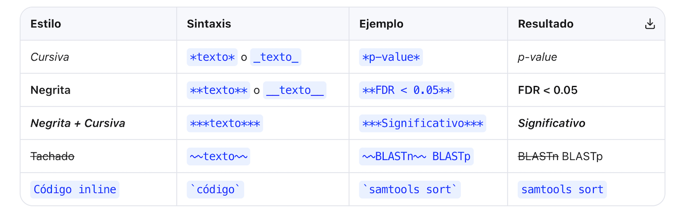
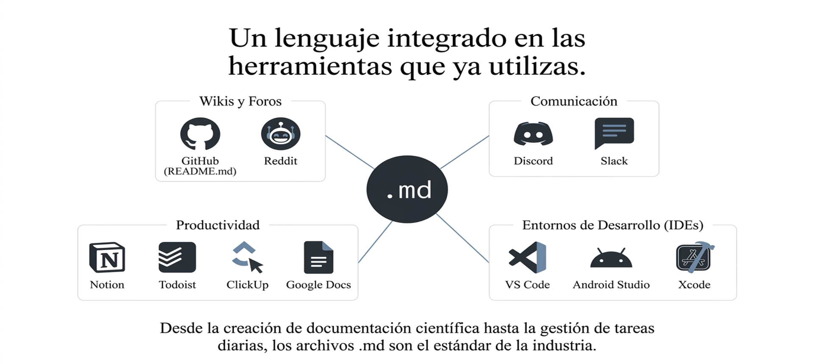
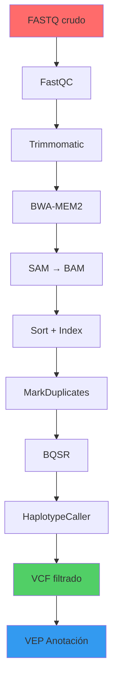
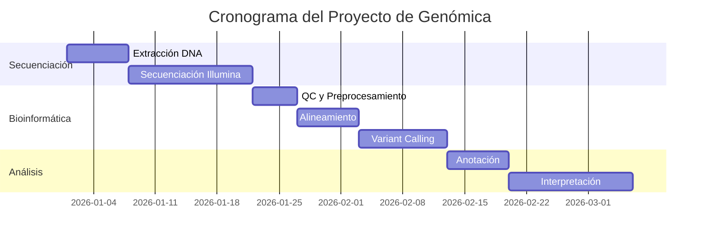
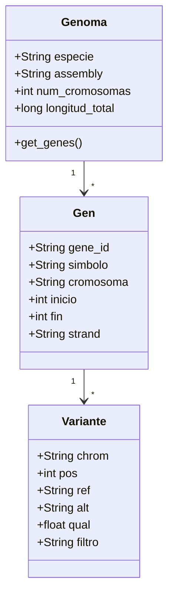
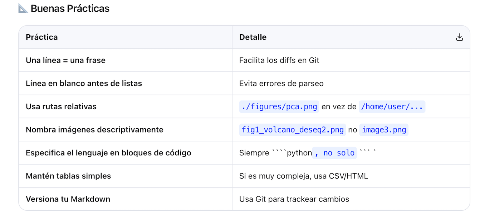
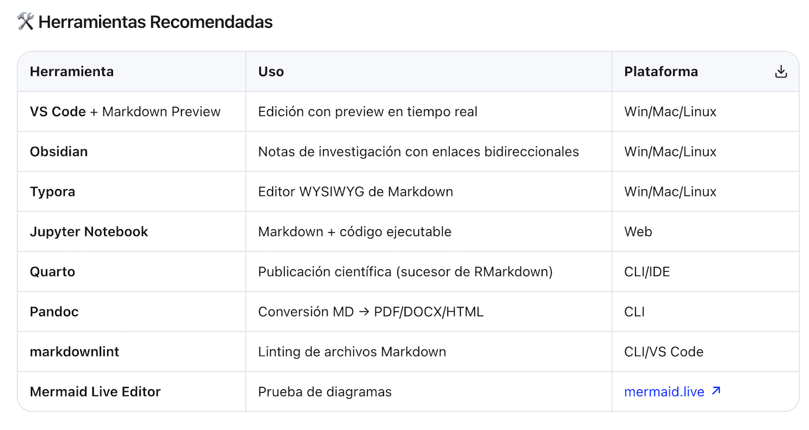

# 1. ¿Qué es Markdown?
   
Markdown es un lenguaje de marcado ligero creado por John Gruber en 2004. Su filosofía es ser fácil de leer y escribir en texto plano, y convertirse fácilmente a HTML.

**¿Por qué es esencial en bioinformática?**

Los archivos README.md son el estándar en repositorios de GitHub/GitLab para pipelines (Nextflow, Snakemake, WDL).
Se usa en Jupyter Notebooks para documentar análisis.

Herramientas como MultiQC, nf-core y Galaxy generan reportes en Markdown.

Es el formato de documentación de paquetes en Bioconductor y PyPI.
---

# 2. Encabezados

Se usan símbolos # al inicio de la línea. El número de # indica el nivel (1–6).

**ejm:**

# Encabezado de Nivel 1 (Título principal del proyecto)
## Encabezado de Nivel 2 (Sección)
### Encabezado de Nivel 3 (Subsección)
#### Encabezado de Nivel 4
##### Encabezado de Nivel 5
###### Encabezado de Nivel 6

**Ejm en Bioinformática:**

# Análisis de RNA-Seq: Diferencial de Expresión en *Arabidopsis thaliana*
## 1. Control de Calidad
### 1.1 FastQC
### 1.2 MultiQC
## 2. Alineamiento con HISAT2
## 3. Cuantificación con featureCounts

---

# 3. Párrafos y Saltos de Línea

**Párrafos**

Deja una **línea en blanco** entre bloques de texto para crear párrafos separados.

**ejm:**

El genoma de *Escherichia coli* K-12 tiene aproximadamente 4.6 Mb.

Contiene alrededor de 4,288 genes codificantes de proteínas según la anotación de RefSeq.

**Saltos de línea simples**

Añade dos espacios al final de la línea o usa **< br >** pero sin espacios entre br y los simbolos que le rodean

**ejm 1:**  
Secuencia forward: ATCGATCGATCG<br>
Secuencia reverse: CGATCGATCGAT

**ejm 2: Qué paso acá?**  
Secuencia forward: ATCGATCGATCG.
Secuencia reverse: CGATCGATCGAT

---

# 4. Énfasis de Texto



[](https://www.ensembl.org)

**ejm:**

El gen ***TP53*** está mutado en el 50% de los cánceres humanos.

Se utilizó **DESeq2** con un umbral de *log2FoldChange* > 1 y `padj < 0.05`.

El alineador ~~Bowtie1~~ **Bowtie2** fue seleccionado por su soporte de gaps.

---

# 5. Listas
## 5.1 Listas Desordenadas

Usa -, * o + al inicio de cada ítem.

**ejm:**

- Herramientas de alineamiento:
  - BWA-MEM2
  - Bowtie2
  - STAR
  - HISAT2
- Lenguajes de programación:
  - Python (Biopython, Scanpy)
  - R (Bioconductor, Seurat)
  - Bash/Shell

## 5.2 Listas Ordenadas
Usa números seguidos de punto.

**ejm:**

1. Descarga de datos crudos desde SRA (ENA/GEO)
2. Control de calidad con FastQC y MultiQC
3. Recorte de adaptadores con Trimmomatic o fastp
4. Alineamiento contra el genoma de referencia (GRCh38)
5. Cuantificación de expresión génica
6. Análisis de expresión diferencial con DESeq2
7. Análisis de enriquecimiento funcional (GO, KEGG)

---

## 5.3 Listas Mixtas

**ejm:**

1. **Preprocesamiento**
   - Control de calidad
   - Filtrado por calidad (Q ≥ 30)
2. **Alineamiento**
   - Genoma de referencia: `hg38`
   - Índice construido con:
     - `bwa index hg38.fa`
     - `samtools faidx hg38.fa`
3. **Análisis downstream**
   - Variant calling (GATK HaplotypeCaller)
   - Anotación (VEP, SnpEff)

---

# 6. Enlaces

**Sintaxis básica**

[Texto visible](URL)

**ejm:**

- Base de datos de referencia: [NCBI GenBank](https://www.ncbi.nlm.nih.gov/genbank/)
- Buscador de ontologías: [AmiGO (Gene Ontology)](http://amigo.geneontology.org/)
- Repositorio de datos: [GEO Dataset GSE12345](https://www.ncbi.nlm.nih.gov/geo/query/acc.cgi?acc=GSE12345)
- Documentación: [DESeq2 en Bioconductor](https://bioconductor.org/packages/release/bioc/html/DESeq2.html "Documentación oficial de DESeq2")

**Enlaces con referencia (útil para documentos largos)**

**ejm:**

El alineamiento se realizó con BWA-MEM2 [1] y las variantes se llamaron con GATK [2].

[1]: https://github.com/bwa-mem2/bwa-mem2 "BWA-MEM2 GitHub"
[2]: https://gatk.broadinstitute.org/ "Genome Analysis Toolkit"

**Enlaces automáticos**

**ejm:**

<https://www.uniprot.org/uniprotkb/P04637/entry>  
<mailto:bioinfo@lab.edu>

---

# 7. Imágenes

**Sintaxis:**

**ejm:**  


**Imagen con enlace**

[](https://www.ensembl.org)

---

# 8. Código
## 8.1 Código Inline

Rodea el código con comillas invertidas (backticks) `.

**ejm:**

Ejecuta `samtools flagstat aligned.bam` para obtener estadísticas de alineamiento.  
El gen `BRCA1` se encuentra en el cromosoma 17q21.31.

## 8.2 Bloques de Código  
Usa triple backtick ``` con el lenguaje para resaltado de sintaxis.  

**Bash / Shell**

**ejm:**

```{bash}
# Descarga de datos desde SRA
fasterq-dump SRR1234567 --threads 8

# Control de calidad
fastqc -t 4 -o results/fastqc/ raw_data/*.fastq.gz

# Alineamiento con BWA-MEM2
bwa-mem2 mem -t 16 ref/hg38.fa sample_R1.fq.gz sample_R2.fq.gz \
  | samtools sort -@ 8 -o results/bam/sample.sorted.bam

# Indexar BAM
samtools index results/bam/sample.sorted.bam
```
**Python**

```python
import pandas as pd
import scanpy as sc

# Cargar datos de scRNA-seq
adata = sc.read_h5ad("data/pbmc3k.h5ad")

# Preprocesamiento
sc.pp.filter_cells(adata, min_genes=200)
sc.pp.filter_genes(adata, min_cells=3)
sc.pp.normalize_total(adata, target_sum=1e4)
sc.pp.log1p(adata)

# PCA y clustering
sc.tl.pca(adata, svd_solver='arpack')
sc.pp.neighbors(adata, n_neighbors=10, n_pcs=40)
sc.tl.umap(adata)
sc.tl.leiden(adata, resolution=0.5)

# Visualización
sc.pl.umap(adata, color=['leiden', 'CD3D', 'MS4A1'])
```
**R**

```r
library(DESeq2)
library(ggplot2)

# Cargar matriz de conteos
countData <- read.csv("counts_matrix.csv", row.names = 1)
colData <- read.csv("sample_metadata.csv", row.names = 1)

# Crear objeto DESeq2
dds <- DESeqDataSetFromMatrix(
  countData = countData,
  colData = colData,
  design = ~ condition
)

# Análisis diferencial
dds <- DESeq(dds)
res <- results(dds, contrast = c("condition", "treated", "control"))
res_sig <- subset(res, padj < 0.05 & abs(log2FoldChange) > 1)

# Volcano plot
ggplot(as.data.frame(res), aes(x = log2FoldChange, y = -log10(padj))) +
  geom_point(alpha = 0.4) +
  theme_minimal() +
  labs(title = "Volcano Plot - Treated vs Control")
```
**FASTA / Formato de secuencias** 

```fasta
>sp|P04637|P53_HUMAN Cellular tumor antigen p53 OS=Homo sapiens
MEEPQSDPSVEPPLSQETFSDLWKLLPENNVLSPLPSQAMDDLMLSPDDIEQWFTEDPGP
DEAPRMPEAAPPVAPAPAAPTPAAPAPAPSWPLSSSVPSQKTYPQGLNGTVNLPGRNSFEV
```

---

# 9. Tablas

**Sintaxis básica**

**ejm:**

| Columna 1 | Columna 2 | Columna 3 |
|-----------|-----------|-----------|
| Dato 1    | Dato 2    | Dato 3    |

**Alineación**

:--- Izquierda (default)
:---: Centro
---: Derecha

**Ejm:** Resumen de Muestras de RNA-Seq

| Muestra | Condición | Réplica | Lecturas (M) | % Mapeo | Genes Detectados |
|:--------|:---------:|:-------:|-------------:|--------:|-----------------:|
| WT_1    | Control   | 1       | 42.3         | 94.2    | 18,432           |
| WT_2    | Control   | 2       | 38.7         | 93.8    | 17,985           |
| WT_3    | Control   | 3       | 45.1         | 95.1    | 18,701           |
| KO_1    | Knockout  | 1       | 41.0         | 92.5    | 16,234           |
| KO_2    | Knockout  | 2       | 39.5         | 91.9    | 15,876           |
| KO_3    | Knockout  | 3       | 43.8         | 93.4    | 16,543           |

**Ejm:** Comparación de Herramientas

| Herramienta | Tipo | Lenguaje | Tiempo (h) | RAM (GB) | Publicación |
|-------------|------|----------|-----------:|---------:|-------------|
| STAR        | Spliced aligner | C++ | 0.5 | 30 | Dobin et al., 2013 |
| HISAT2      | Spliced aligner | C++ | 1.2 | 8  | Kim et al., 2019 |
| Salmon      | Pseudoaligner | C++ | 0.1 | 4  | Patro et al., 2017 |
| Kallisto    | Pseudoaligner | C++ | 0.08 | 3 | Bray et al., 2016 |

---

# 10. Citas y Bloques

**Cita simple**

**ejm:**

> "The central dogma of molecular biology deals with the detailed residue-by-residue
> transfer of sequential information." — Francis Crick, 1970

**Cita anidada**

**ejm:**

> El análisis de expresión diferencial reveló 1,247 genes significativamente regulados.
>
> > De estos, 834 estaban sobreexpresados (log2FC > 1) y 413 subexpresados (log2FC < -1).
> >
> > > El gen más sobreexpresado fue *IL6* (log2FC = 5.3, padj = 2.1e-45).

**ejm lista anidada**

1. First list item
   - First nested list item
     - Second nested list item

**Cita con formato**

**ejm:**

> **Nota importante:** Los archivos BAM deben estar ordenados por coordenadas
> antes de ejecutar `bcftools mpileup`. Consulta la [documentación de Samtools](https://www.htslib.org/).

---

# 11. Líneas Horizontales

Usa tres o más ---, *** o ___.

**ejm:**

Resultados del control de calidad:

---

Resultados del alineamiento:

***

Resultados del variant calling:

---

# 12. Listas de Tareas

**Sintaxis**

**ejm:**

- [x] Tarea completada
- [ ] Tarea pendiente
  
**ejm:**

**Ejemplo: Pipeline de WGS**

### Checklist del Pipeline de Whole Genome Sequencing

- [x] Descarga de FASTQ desde ENA
- [x] FastQC + MultiQC
- [x] Trimmomatic (recorte de adaptadores)
- [x] Alineamiento BWA-MEM2 → BAM sorted
- [x] Marcado de duplicados (Picard MarkDuplicates)
- [x] Base Quality Score Recalibration (GATK BQSR)
- [ ] Variant Calling (GATK HaplotypeCaller)
- [ ] Variant Filtering (VQSR)
- [ ] Anotación con VEP/SnpEff
- [ ] Interpretación clínica (ACMG guidelines)
- [ ] Subida de resultados a base de datos interna
  
---

# 13. Notas al Pie

**Sintaxis**

**ejm:**

Texto con nota al pie[^1].

[^1]: Contenido de la nota.

**Ejemplo en Bioinformática**

El análisis de enriquecimiento se realizó usando el test de Fisher exacto[^1]
con corrección de Benjamini-Hochberg[^2]. Los genes de referencia se obtuvieron
de la base de datos MSigDB[^3].

[^1]: Fisher, R.A. (1922). On the interpretation of χ² from contingency tables.
[^2]: Benjamini, Y. & Hochberg, Y. (1995). Controlling the false discovery rate. *JRSS-B*, 57(1), 289-300.
[^3]: Subramanian, A. et al. (2005). Gene set enrichment analysis. *PNAS*, 102(43), 15545-15550.

**Las foonotes se nos van al final del libro**
---

# 14. HTML Embebido

**Markdown permite HTML cuando necesitas más control.**

<details>
<summary>🔬 Haz clic para ver los parámetros de Trimmomatic</summary>

| Parámetro | Valor | Descripción |
|-----------|-------|-------------|
| ILLUMINACLIP | TruSeq3-PE.fa:2:30:10 | Recorte de adaptadores |
| LEADING | 3 | Elimina bases con Q < 3 al inicio |
| TRAILING | 3 | Elimina bases con Q < 3 al final |
| SLIDINGWINDOW | 4:20 | Ventana de 4 bases, Q media ≥ 20 |
| MINLEN | 36 | Longitud mínima de lectura |

</details>

---

# 15. Diagramas con Mermaid

Soportado en GitHub, GitLab y Obsidian.  
Diagrama de Flujo (Pipeline)  
**ejm:**. 

**ejm: Diagrama de Gantt (Cronograma)**


**ejm: Diagrama de Clases (Estructura de datos)**



---

# 16. YAML Front Matter. 
Bloque de metadatos al inicio del documento (usado en Jekyll, RMarkdown, Hugo, Quarto).  
**ejm:**  
---
title: "Análisis de scRNA-seq de PBMCs"
author: "Dra. María López"
date: "2026-07-15"
output: 
  html_document:
    toc: true
    theme: flatly
    code_folding: hide
params:
  min_genes: 200
  resolution: 0.5
  organism: "Homo sapiens"
  genome: "GRCh38"
---

---

# 17. Escapado de Caracteres. 
Usa \ para escapar caracteres especiales de Markdown.  
**ejm:**

\*Esto no es cursiva\*
\# Esto no es un encabezado
\[Esto no es un enlace\]
\`Esto no es código\`

Caracteres escapables: \ ` * _ { } [ ] ( ) # + - . ! | ~

**Ejemplo práctico**  
El comando `awk '{print $1}'` usa llaves y el signo `$`.
Para escribir **C\+\+** en Markdown, escapa los signos `+`.
El cromosoma se denota como chr17\:q21.31.

---

# Buenas Prácticas y Herramientas



---

# Herramientas Recomendadas




