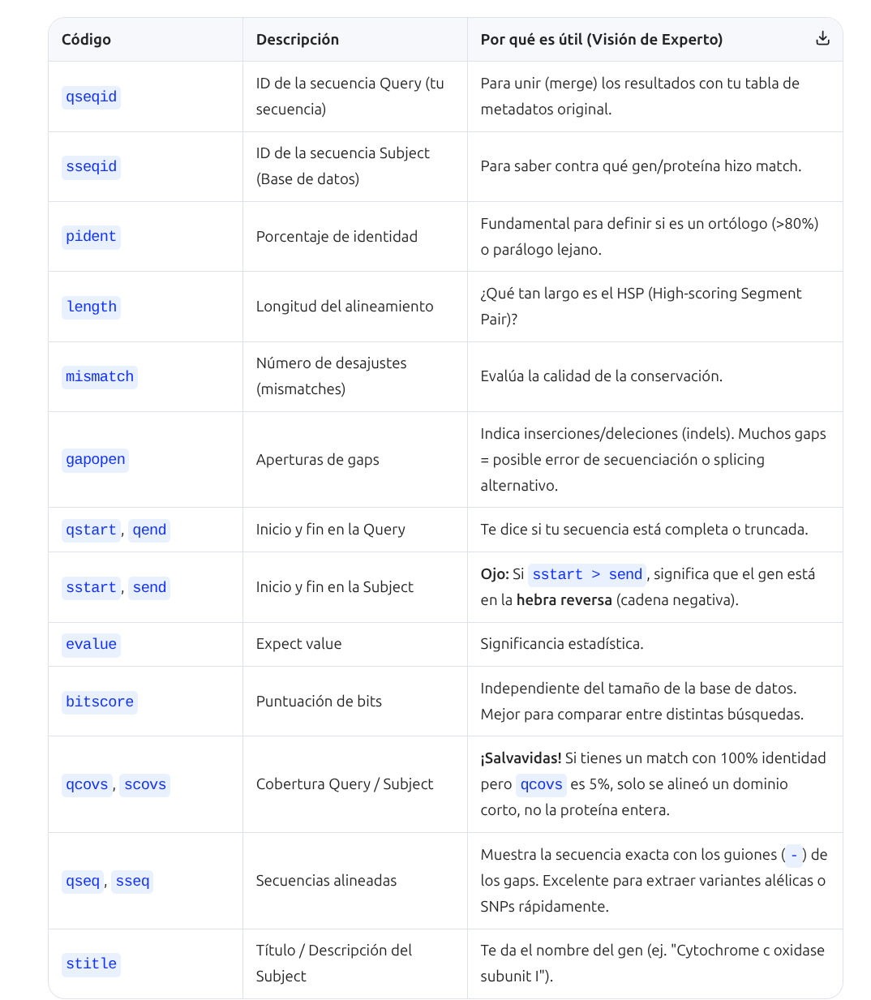
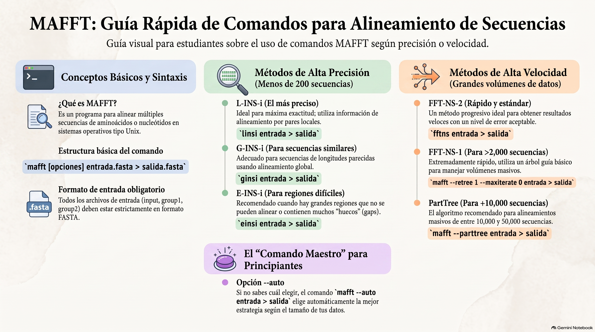

# Requerimientos minimos

   - conda install conda-forge::ncbi-datasets-cli
   - conda install bioconda::entrez-direct
   - conda install bioconda::blast
   - conda install -c bioconda blast=2.16.0
   - conda install openssl 

# 1. Descarga los datos (Wolbachia_pipientis)

 - datasets download genome accession GCF_007971685.1 --include gff3,rna,cds,protein,genome,seq-report
 - unzip ncbi_dataset.zip
 - chmod +x ncbi_dataset
 - mv ncbi_dataset Wolbachia_pipientis
 - renombra los archivos que estan en la carpeta que comienza por GCF_ (protein.faa, cds.fna, genomic.fna). Por ejm: wol1_protein.faa, wol1_cds.fna, wol1_genomic.fna

# 2. Descarga los datos (Wolbachia_endosymbiont_of_Drosophila_melanogaster)
## repite los pasos anteriores para:

 - datasets download genome accession GCF_947533255.1 --include gff3,rna,cds,protein,genome,seq-report
 - renombra los archivos del archivo que comienza por GCF_ como en el paso anterior, en este caso por ejm que comiencen por wol2_
  
# 3. crea una carpeta llamada todo copia los archivos renombrados de ambos sets en ella: 
 
# 4. Blast
## Vamos a contrastar datos entre diferentes cepas

## Tutorial 1: blastn Local (Nucleótido vs Nucleótido)
Escenario de uso: Tienes un genoma  ensamblado de de secuencias de ADN  y quieres alinearlas contra un genoma de referencia local o una base de datos de genes descargada.

## Paso 1: Preparar la Base de Datos Local: BLAST no lee archivos FASTA planos directamente como base de datos; debe "formatearlos" creando índices binarios.
  
  - makeblastdb -in wol1_genomic.fna -dbtype nucl -out mi_db_wol1  
    + -dbtype nucl: Indica que es una base de datos de nucleótidos.  
    + -out: El prefijo para los archivos de índice generados (.nhr, .nin, .nsq, etc.).  
  - blastn -query wol2_cds.fna -db mi_db_wol1 -out blastn1_resultados.tsv -evalue 1e-10 -outfmt "6 std qseq sseq stitle" -num_threads 4 -dust yes  
    **Parámetros Clave Explicados:**
    + -evalue 1e-10: El Expect value. Número de alineamientos esperados por azar. 1e-10 es muy estricto, ideal para encontrar ortólogos cercanos.
    + -num_threads 4: Usa 4 núcleos de tu CPU (ajusta según tu servidor).
    + -dust yes: Algoritmo para enmascarar regiones de baja complejidad (repeticiones de un solo nucleótido como AAAAA) que generan falsos positivos.

## Tutorial 2: blastp Local (Proteína vs Proteína)
Escenario de uso: Has predicho los de un organismo nuevo y quieres anotarlo funcionalmente buscando dominios u homólogos en una base de datos local (ej. UniProt/SwissProt, Uniref, NCBI, etc).

## Paso 1: Preparar la Base de Datos Local

  - makeblastdb -in wol1_protein.faa -dbtype prot -out wol1_pro_db

## Paso 2: Ejecutar el blastp y blastx

  - blastp -query wol2_protein.faa -db wol1_pro_db  -out blastp1_resultados.tsv  -evalue 1e-5  -outfmt "6 qseqid sseqid pident length mismatch gapopen qstart qend sstart send evalue bitscore stitle"  -num_threads 4 -matrix BLOSUM62  -max_target_seqs 5 -seg yes

  - blastx -query wol2_cds.fna -db wol1_pro_db  -out blastx1_resultados.tsv  -evalue 1e-5  -outfmt "6 qseqid sseqid pident length mismatch gapopen qstart qend sstart send evalue bitscore stitle"  -num_threads 4 -matrix BLOSUM62  -max_target_seqs 5 -seg yes  
    **Parámetros Clave Explicados:**  
    + -matrix BLOSUM62: La matriz de sustitución por defecto. (Usa BLOSUM45 o PAM30 si buscas homólogos muy lejanos evolutivamente).
    + -max_target_seqs 5: ¡Crucial! Limita la salida a los 5 mejores alineamientos (HSPs) por cada secuencia query. Esto ahorra muchísimo tiempo y espacio en disco en búsquedas masivas.
    + -seg yes: Enmascara regiones de baja complejidad en proteínas (ej. repeticiones de poliglutamina).

## Tutorial 3: blastn Remoto (Contra servidores de NCBI)
Escenario de uso: Necesitas buscar tus secuencias contra la base de datos masiva nt (Nucleotide collection), la cual pesa cientos de Gigabytes y no tienes espacio en disco para alojarla localmente.

  - blastn -query wol2_cds_test.fna  -db nt  -out blastn_remoto.tsv  -remote  -entrez_query "txid11[ORGN]"   -evalue 1e-20  -outfmt "6 std"  -max_target_seqs 10  
    **Parámetros Clave Explicados:**  
    + -remote: Le dice a BLAST+ que envíe la búsqueda a los servidores del NCBI en lugar de buscar localmente.
    + -entrez_query "txid9606[orgn]": Truco de experto. Filtra la base de datos remota usando sintaxis de Entrez. En este ejemplo, txid9606 es el TaxID de Homo sapiens. Esto reduce drásticamente el tiempo de búsqueda y evita saturar la red.
    + -Nota sobre API Keys: NCBI limita las búsquedas remotas a 3 por segundo. Si configuras una API Key de NCBI y la pasas con el parámetro -api_key TU_API_KEY, el límite sube a 10 búsquedas por segundo.

## Tutorial 4: blastp Remoto (Contra servidores de NCBI)
Escenario de uso: Anotación rápida contra nr (Non-redundant protein sequences) o swissprot sin descargar la base de datos.

  -  blastp -query wol2_protein_test.faa -db nr -out blastp_remoto.tsv  -remote  -evalue 1e-5  -outfmt "6 std qcovs scovs"  -max_target_seqs 3 -comp_based_stats 1
     **Parámetros Clave Explicados:**
     + -comp_based_stats 1: (Compositional-based statistics). Ajusta los valores de E-value basándose en la composición de aminoácidos de las secuencias. Es fundamental en blastp remoto para reducir falsos positivos en proteínas con composiciones sesgadas.
     + -qcovs y -scovs: Parámetros de salida (ver abajo) que indican la cobertura de la alineación. Muy útiles para descartar alineamientos que solo cubren un pequeño dominio pero no la proteína entera.

# Guía Maestra de Formatos de Salida (-outfmt)

El formato por defecto (-outfmt 0) es legible para humanos (texto plano con alineamientos visuales), pero inútil para la bioinformática computacional. En bioinformática, casi siempre usamos formatos tabulares delimitados por tabulaciones (-outfmt 6 o 7) para poder importarlos a pandas en Python o data.table en R.

## Formatos Numéricos Básicos
   - -outfmt 0: Pairwise (Alineamiento visual clásico).
   - -outfmt 6: Tabular separado por tabulaciones (El estándar).
   - -outfmt 7: Tabular con líneas de comentarios (útil para saber los parámetros usados al inicio del archivo).
   - -outfmt 11: Archivo de resultados BLAST binario. (Permite usar blast_formatter después para generar otros formatos sin volver a correr el BLAST. ¡Ideal para clusters HPC!).

El Formato Tabular Personalizado (-outfmt "6 ..." )
Puedes construir tu propia tabla eligiendo qué columnas exportar. Aquí están las columnas más importantes y lo que significan:

# Deep Dive: Parámetros Avanzados que todo Bioinformático debe conocer

- **-word_size (Tamaño de palabra):**  
BLAST funciona buscando "semillas" o palabras exactas de un tamaño determinado antes de extender el alineamiento.
En blastn, el default suele ser 11 o 28. Si buscas secuencias muy cortas (ej. miARN o primers), DEBES bajarlo a -word_size 7 o -word_size 4 (usando blastn-short), de lo contrario, no encontrará nada.
- **-gapopen y -gapextend:**  
Penalizaciones por abrir un gap y por extenderlo.
Tip de experto: Si estás alineando secuencias de diferentes especies donde esperas eventos de splicing alternativo o dominios perdidos, puedes relajar la penalización de - -gapopen para permitir que el alineamiento "salte" regiones sin romperse.
- **-lcase_masking:**  
Si tu archivo FASTA de entrada tiene regiones en minúsculas (ej. atgc en lugar de ATGC) que representan regiones enmascaradas por RepeatMasker, esta opción le dice a BLAST que ignore esas minúsculas durante la búsqueda.
- **-strand (Solo para blastn):**  
Puedes limitar la búsqueda a -strand plus o -strand minus. Útil si ya sabes que tus transcriptos están orientados en una dirección específica (ej. librerías strand-specific de RNA-Seq).

# Alineamientos con MAFFT

